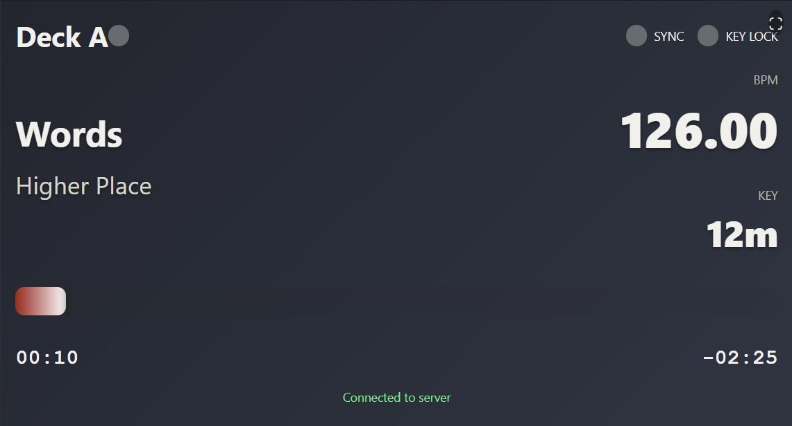
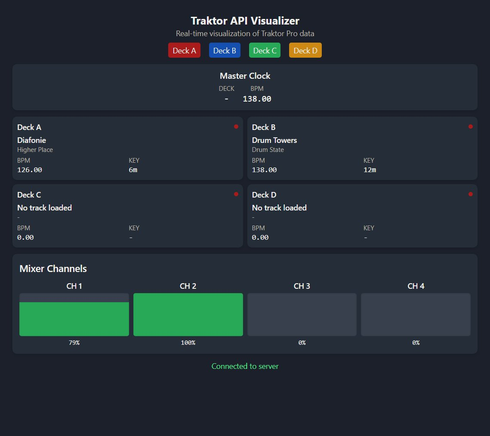

# API client to send live track data from Traktor Pro to a web server

By default data is sent to `http://localhost:8080`. You can change this in `ApiClient.js`.

The following endpoints are used:
- `/deckLoaded/<deck>`: Called when a track is loaded into a deck.
- `/updateDeck/<deck>`: Called when certain values or state changes for a deck.
- `/updateMasterClock`: Called when the master deck or BPM changes.
- `/updateChannel/<channel>`: Called when state changes for a mixer channel.

## How to install

**Mac:**

  - Navigate to /Applications/Native Instruments/Traktor Pro 3
  - Right click Traktor.app, then click Show Package Contents
  - Navigate to Contents/Resources/qml/CSI
  - Make a backup of the D2 folder!
  - Replace the D2 folder
  - Restart Traktor
  - If you don't own a Traktor Kontrol D2:
    - Go to Preferences > Controller Manager
    - Below the Device dropdown, click Add… > Traktor > Kontrol D2

**Windows:**

  - Navigate to C:\Program Files\Native Instruments\Traktor Pro 3\Resources64\qml\CSI
  - Make a backup of the D2 folder!
  - Replace the D2 folder
  - Restart Traktor
  - If you don't own a Traktor Kontrol D2:
    - Go to Preferences > Controller Manager
    - Below the Device dropdown, click Add… > Traktor > Kontrol D2

## Example Projects

This repository includes example projects that demonstrate how to receive and process data from the Traktor D2 API client.

### Node.js Example (Real-time Visualization)

A comprehensive real-time visualization tool that displays the data sent by the API client.

Features:
- All 4 decks (A, B, C, D) with track information, BPM, and play status
- Master clock with BPM and active deck
- Mixer channels with level meters and on-air indicators
- Browser/playlist navigation information
- Individual deck views for focused monitoring
- Responsive design that works on mobile and desktop

To use the visualization:
1. Install dependencies: `npm install` (in node-example directory)
2. Start the visualization server: `npm run start`
3. Open your browser and navigate to:
   - http://localhost:8081/ - Main visualization
   - http://localhost:8081/a - Deck A view
   - http://localhost:8081/b - Deck B view
   - http://localhost:8081/c - Deck C view
   - http://localhost:8081/d - Deck D view

Deck A view:

Full view:

For more information, see [node-example/README.md](node-example/README.md).

### Python Example (Command-line)

A simple Python example that demonstrates how to receive data from the Traktor D2 API client and process it in a command-line application.

Features:
- No external dependencies (uses only Python standard library)
- Receives data from all API endpoints
- Processes deck loading events
- Handles deck state updates
- Monitors master clock changes
- Tracks mixer channel updates
- Simple command-line output

To use the Python example:
1. Make sure Traktor Pro is running with the modified D2 controller
2. Run the example script: `python python-example/traktor_api_example.py`
3. Load tracks and interact with Traktor to see the data flow

For more information, see [python-example/README.md](python-example/README.md).